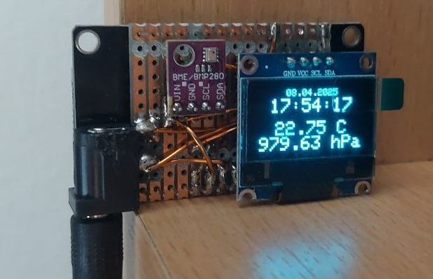

# 🐢 senseBox WiFi Weather Display

This is a custom-built ESP8266-based weather display for OpenSenseMap using a BMP280 sensor and a 128x64 OLED display.  
It syncs time over NTP, shows date, time, temperature, and pressure, and uploads data to OpenSenseMap once per hour.

## 🧠 Features

- 📡 WiFi connectivity with NTP time sync (CET/CEST timezone)
- 🌡 BMP280 sensor for temperature and pressure
- 🖥 SSD1306 OLED for clean UI (no fancy animations, just useful data)
- ☁️ Uploads data to OpenSenseMap once per hour
- 🔐 All credentials are stored safely in `secrets.h` (not committed)

## 📷 Display Layout
```
08.04.2025
21:57:42
19.35 C
1012.57 hPa
```

## 🛠 Requirements

- ESP8266 board (like NodeMCU)
- BMP280 sensor (I²C)
- SSD1306 128x64 OLED (I²C)
- PlatformIO with VS Code
- OpenSenseMap account + sensor IDs

## 🧪 Getting Started

1. Clone the repo
2. Create your `secrets.h` file:
   ```cpp
   #pragma once

   #define WIFI_SSID "your_wifi"
   #define WIFI_PASS "your_password"

   #define OSEM_BOX_ID "your_box_id"
   #define SENSOR_ID_TEMP "your_temp_id"
   #define SENSOR_ID_PRES "your_pres_id"

   #define OSEM_AUTH "your_super_secret_token"
   ```